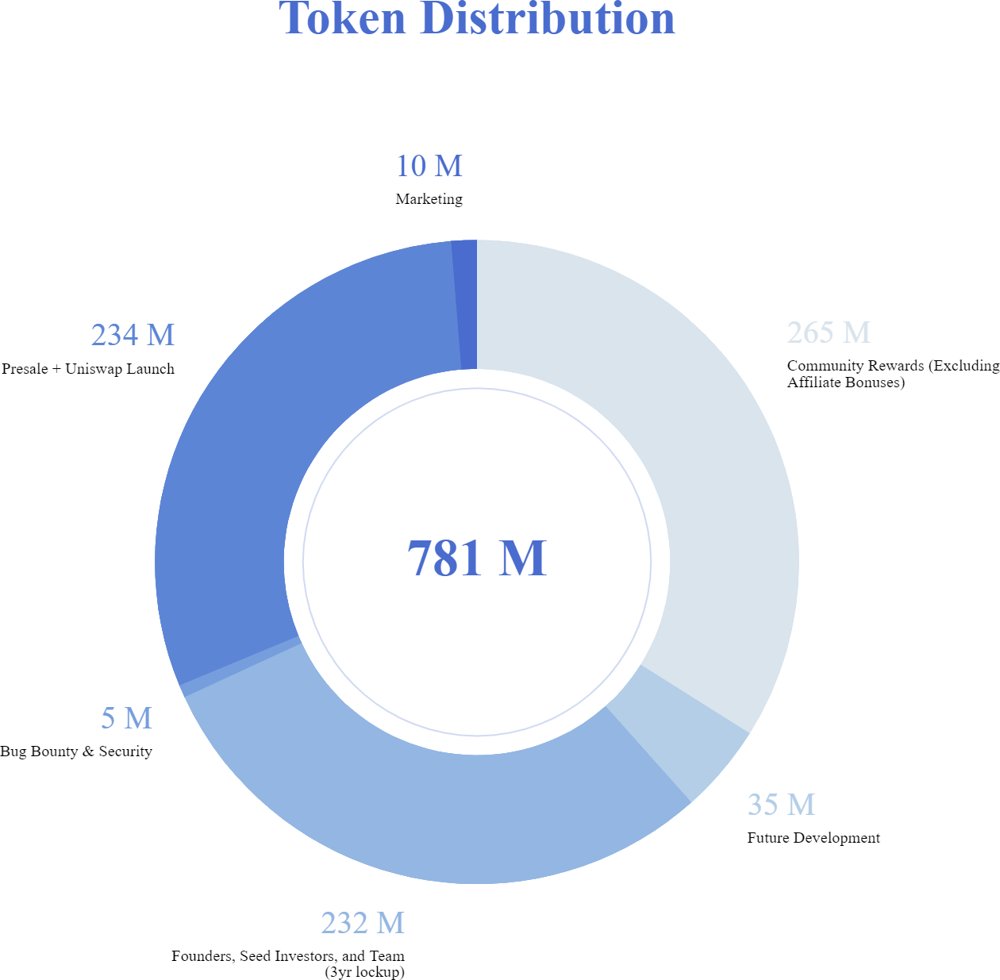

# 2.1.1 - Token Distribution

34%  / 265M to: Community / Rewards to liquidity providers

29% / 234 M to: Presale Auction + Uniswap Launch Supply

30% / 232 M to: Founders, seed investors, and team \(3 year lockup\)

4% / 35M to: Future Development

2.2% / 10M to: Marketing

.8% / 5M to: Bug Bounty & Security

