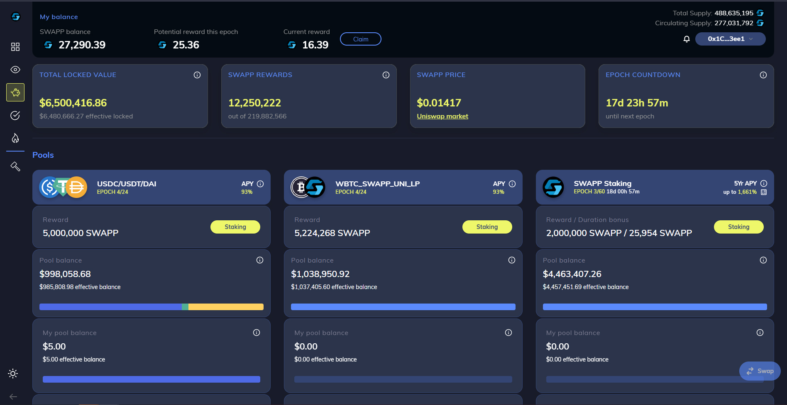

# 1.0.0 - Introducing SWAPP

**SWAPP Protocol** is an Ethereum blockchain ERC-20 and BEP-20 smart contract. SWAPP is a decentralized, fairly launched utility token used to both facilitate yield farming rewards in the Swapp DeFi platform as well as serve as the form of rewards within the Swapp smartphone app \(on ios and android\).

**Built on Ethereum, now also available on Binance Smart Chain**

SWAPP also exists on Binance Smart Chain as a [BEP-20 token](https://bscscan.com/address/0x0efe961c733ff46ce34c56a73eba0c6a0e18e0f5) and can be traded on [PancakeSwap](https://pancakeswap.finance/swap?outputCurrency=0x0efe961c733ff46ce34c56a73eba0c6a0e18e0f5). There are plans to expand SWAPP on to additional chains including Polygon, Cronos\(crypto.com\), and others.

This document is a general technical specification of the contract and its functionality.

**Our Mission**

Swapp is leading a massive [movement](motivations-and-principles.md) to disrupt the $1.2T/yr data industry. For far too long, tech giants like Google and Facebook have tracked your every move, earned _**billions**_ per year in monetization, but have shared none of that revenue with you, _**the rightful owner.**_

**Our Motivation**

The average person is shown over 100 ads per day. And while the tech giants earn billions of dollars, you earn zero. That ends today.

Swapp RE-imagines data monetization by using the blockchain to cut out the middlemen and distributes 100% of data revenue to its users \(in the form of SWAPP tokens\).

