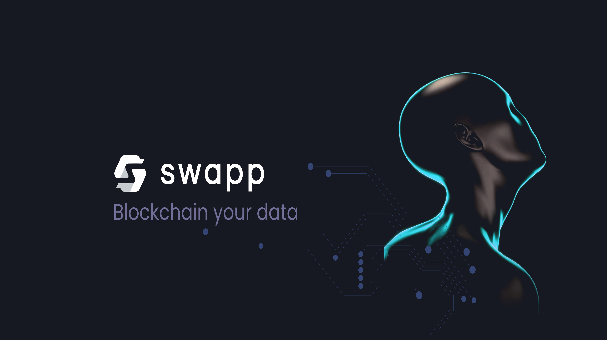

# Cross-chain SWAPP Protocol

**SWAPP Protocol** is the future of data. It's time to take back control over what happens with your personal information, and Swapp will provide a decentralized marketplace that rewards you for it!

Swapp is a company that helps you get paid for your data. There are many people who use the internet every day, but they don't get paid for it. Swapp helps these people. It uses blockchain technology to make data more safe and private.

The company's goal is to put power back into the hands of each individual person, because that's where it belongs. Swapp is changing the way people earn money. People will get what they deserve for their data that they own, and there won't be a middleman to take it. Swapp pays people in cryptocurrency and also give them privacy when using their data.

is an Ethereum blockchain ERC-20 and BEP-20 smart contract. SWAPP is a decentralized, fairly launched utility token used to both facilitate yield farming rewards in the Swapp DeFi platform as well as serve as the form of rewards within the Swapp smartphone app \(on ios and android\).

**Our Mission**

Swapp is leading a massive [movement](motivations-and-principles.md) to disrupt the $1.2T/yr data industry. For far too long, tech giants like Google and Facebook have tracked your every move, earned _**billions**_ per year in monetization, but have shared none of that revenue with you, _**the rightful owner.**_

**Our Motivation**

The average person is shown over 100 ads per day. And while the tech giants earn billions of dollars, you earn zero. That ends today.

Swapp RE-imagines data monetization by using the blockchain to cut out the middlemen and distributes 100% of data revenue to its users \(in the form of SWAPP tokens\).

