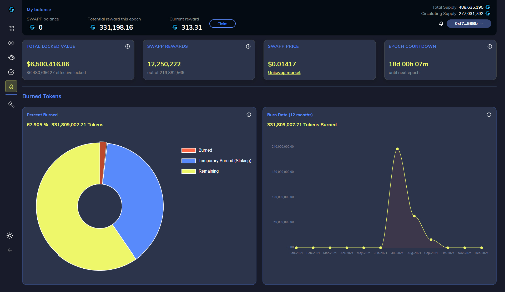

# 2.3.3 - Burning SWAPP Tokens

During first 18-36 months: 100% of interest earned by Swapp platform's secondary market USDC/DAI/USDT positions shall be burned.

**Example:** If $20M exists in USDC (Swapp stable-coin pool) earning 7.00% APY in the Swapp secondary market fund staked with [Compound ](https://compound.finance)earning $116,996 per month. That entire amount of $116,996 would auto-purchase SWAPP tokens from the open market, then send them to a known burn address. This function resembles a traditional "stock buy back" designed to foster reduced supply, higher token price, and re-allocated into the protocol.

[SWAPP Burn Dashboard](https://dapp.swapp.ee/burn)

