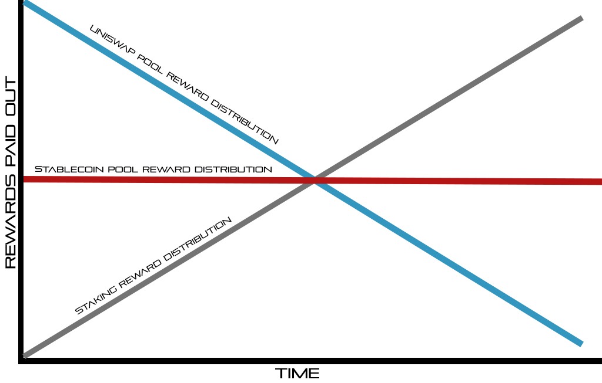

# 2.4 - Three Pool Options

The SWAPP DeFi platform features three (3) SWAPP pools made available to stake in via the SWAPP dashboard.

Each of the 3 Swapp pools pays rewards differently, strategically designed to foster both immediate gratification and long-term adoption.


**USDC/DAI/USDT/sUSD "Stablecoin Pool"**

* This pool enables yield farmers to stake any of the following stablecoins to earn SWAPP tokens as rewards: USDC, DAI, USDT, or sUSD.
* Any combination of the stablecoins can be deposited directly from the user's Metamask wallet into the smart contract via the SWAPP dashboard and no interaction with Uniswap is necessary to participate in this pool.
* **106,083,000** reward tokens allocated to this pool at a rate of 2.5M to 5.00M per (monthly) epoch.
* The reward phases shall be **one month each, with 24 total monthly reward phases**, each paying out to liquidity providers on the last Sunday of each month at 7:30pm EST.
* **Reward Lockup: Stablecoin pool users must stay vested in the pool until the end of each monthly run in order to earn that month's rewards.**



**wBTC/SWAPP Pool**

* LP tokens from the Uniswap wBTC/SWAPP UNI\_LP pool can be staked on the SWAPP platform to earn SWAPP tokens as rewards.
* There is no vesting requirement for this pool (liquidity providers can cash in or out at any time, as often as they want).
* **The 25,000,000 reward tokens are spread over the first 24 months in a decreasing manner as outlined in the graph above.**



**SWAPP Staking**

* The SWAPP contract allows users to [stake](circulation-epoch/staking/) their SWAPP, locking it up for a period of days, in order to earn interest.
* This is the primary function of the contract during the [Circulation Epoch](circulation-epoch/).
* Users may open as many stakes as they like. After a stake reaches full maturity, the user may close it at any time to receive their full principal, plus interest, without penalty.
* **118,917,302 (bonus) reward tokens are spread over the first (5 years) in an increasing manner.**&#x20;


## \*\* SWAPP is planning to open more cross-platform and cross-chain Pools/Vaults during upcoming months. More details will be announced when appropriate partnerships were made.
