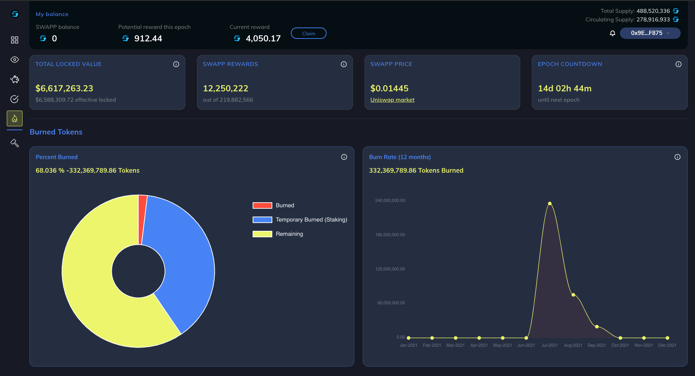

# 2.3.6.1 - Opening Stakes

When a user opens a new stake, they choose an amount of SWAPP to stake, and a stake length in days, weeks, months, or years. The minimum stake amount is 0.000000000001 SWAPP (1000000 TESLA). The minimum stake length is one day, and the maximum stake length is 60 epochs (roughly 5 years).

The "Swapp Staking" pool allows for ONLY one stake at a time. Users can "top up" (add to) an active stake at any time. Accumulated interest can be scraped (cashed out) once per epoch at the close of each epoch.

EXAMPLE: User creates stake for 1 year (12 epochs). User can add to (top up) that 12-month stake multiple times but cannot create a new stake until that 12 months has passed; epoch has matured.

Pending stakes become “Active” status once the deposit is made. At this point, closing the stake before it reaches “Mature” status will incur a penalty. The maximum penalty would occur if the user cashes out during the same epoch of the deposit (100% penalty). For that reason, the "Withdraw" button is disabled during the first epoch the user enters the pool. The penalty slope is a straight line downward, meaning the longer the stake runs, the less the penalty is, should the user need to break the stake. Example: if the user cashes out 50% of the way through the term of the stake, the penalty would be roughly 50% of the principal originally deposited. It is important to plan properly and to only stake for a period which you are willing to stay vested.

When a stake is opened, the SWAPP tokens staked are actually burned by the contract until stake matures or stake owner un-stakes. SWAPP have special [burn dashboard](https://dapp.swapp.ee/burn) which you could track the token burns

