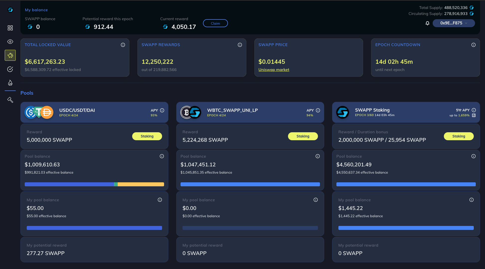
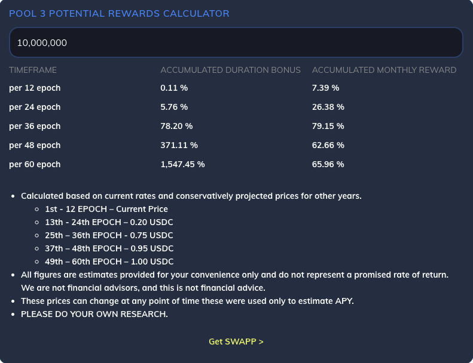

# 2.3.6.2 - Earn Rewards

There are multiple Staking options available on SWAPP DeFi DAPP.

## STABLE COIN POOL - USDC/DAI/USDT

DAPP users may stake following StableCoins, **USDC, USDT,** and **DAI** into SWAPP stable coin staking pools and earn monthly rewards. End of each epoch total of **2.50M to 5.00M SWAPP** tokens are distributed to this pool.

## LIQUIDITY PROVIDER (LP) POOL - WBTC/SWAPP UNI\_LP

**WBTC/SWAPP UNI\_LP** pool is front loaded pool which means the 1st EPOCH has the maximum rewards **9.40M SWAPP** and last 24th EPOCH pays the minimum reward, **240K SWAPP**.

## The APY of the STABLECOIN and  WBTC/SWAPP UNI\_LP pools is calculated based on the below noted formula:

$$
((((Pool Epoch Reward x Token Market Price)/Total Pool Balance)/28)x365)x100
$$

## SWAPP POOL

SWAPP pool is the main 3rd pool as of now which pays the highest APY over 60 epochs (5 years). if you want to stake your SWAPP tokens, then we have this third pool, which right now is giving high APY, it's 1,900%. But it's essentially backloaded.

The longer that you stake for the more tokens that you get, and the last year gives out the most tokens. And that's why we have most of our pool participating in the five year staking because most of those tokens, 70% of them are going to be rewarded at the very end. So, you have a monthly payment that you're going to be receiving a monthly reward, and then you're going to be receiving a duration bonus as well. Please see [this video](https://vimeo.com/587617636) for additional information.

Stakes earn interest daily through the end of the epoch, as well as from other [stakes’ penalties](staking.md) paid. Depending on the length of the stake, price of the token, and total pool size the APY will change.

There are 2 parts of the rewards in this pool as mentioned above, the duration bonus reward, which is paid end of the duration, and the monthly rewards, which user may claim at the end of each epoch. When each epoch ends then the user could go to Swapp DAPP, connect his wallet and claim his current rewards so he/she could receive the rewards that calculated and distributed for the past epoch.

## SWAPP STAKING POOL REWARDS CALCULATOR

Click here to see the link to [calculator ](https://swapp-dev.hubio.dev/widgets/calculator)
