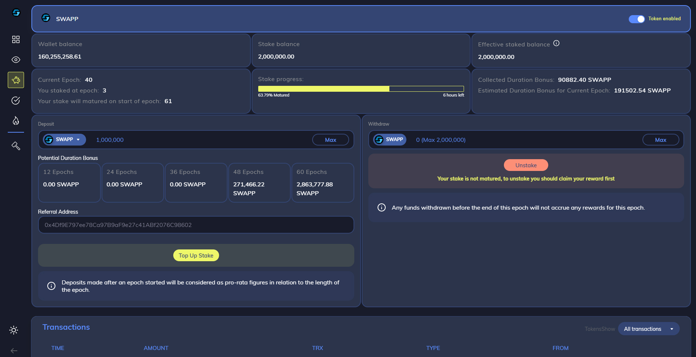

# 2.3.6 - Staking

The SWAPP contract allows users to stake their SWAPP, locking it up for a period of days \(weeks, months, or years\), in order to earn interest. This is the primary function of the contract during the [Circulation Epoch](circulation-epoch.md).

Users may open one stake at a time in each pool. After a stake reaches full maturity, the user may close it at any time to receive their full principal, plus interest, without penalty.

Unlike some other stakeable tokens, SWAPP never penalizes a mature stake, no matter how late it is eventually closed. This allows users much more flexibility, especially for taxable income purposes. 

This longer-term staking pays interest in the form of rewards tokens \(SWAPP\) in two ways:  standard rewards accumulating daily, plus annual "duration bonuses" paid after each 12 epochs \(once per year\) to reward longer-term stakers. 

The "duration bonuses" increase each anniversary to further reward stakers who stay in the pool for 2, 3, 4, and 5 years.

