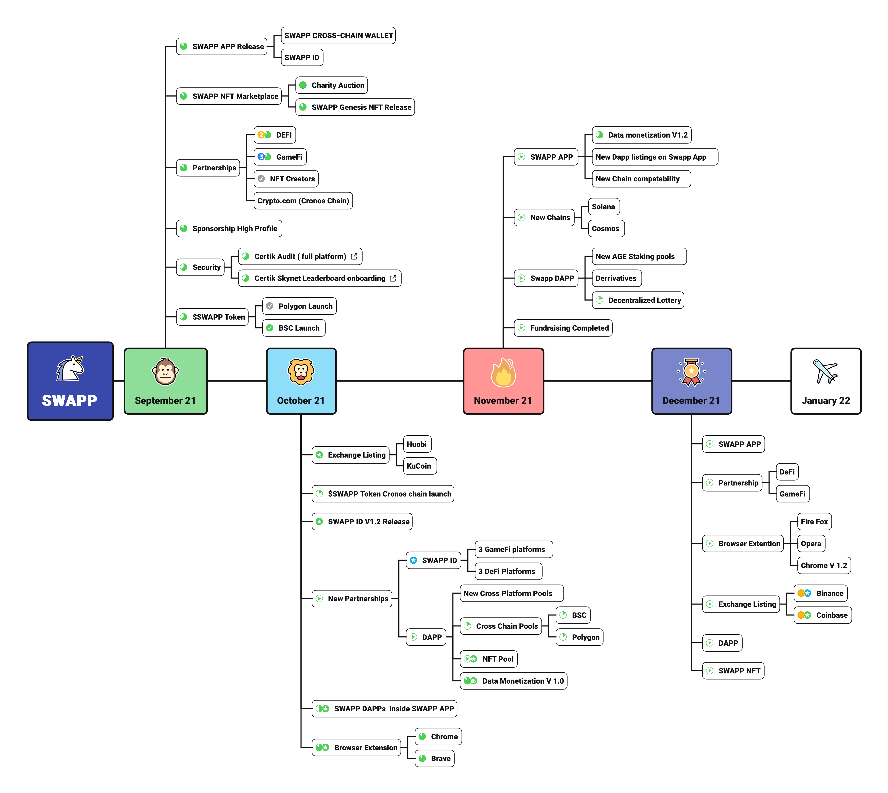

# SWAPP ECOSYSTEM

## Swapp Ecosystem is consists of :

* [SWAPP Data platform for Privacy and Monetization](swapp-data-app-and-platform.md)
* [SWAPP DEFI (DAPP)](swapp-defi-dapp.md)
* [DEX (Decentralized exchange)](decentralized-exchange.md)
* [Swapp token Bridge](bridge.md)&#x20;
* [SWAPP NFT MarketPlace](swapp-nft-marketplace.md)
* [SWAPPID & Wallets](swappid-and-wallet.md)
* [SWAPP Banking - includes Exchange, Cards, and Bank Accounts.](swapp-banking.md)
* Browser Extension

## Organization Structure

We have a team that has been hand-selected for their credibility and knowledge in the industry. They all share the same vision of the future. It is truly international and decentralized team when it comes to diversity. There are people from 10 different countries, including Estonia, United Kingdom, United States, Canada, Belarus, Ukraine, Russia, Nigeria and Poland.

The team is made up of people who know a lot about finance, cyber-forensics, technology, development, and crypto. They have worked together to create our vision for the future. We also have traditional roles like Chief Operating Officer or Chief Marketing Officer. Our team has already accomplished many goals in the past years, creating various tech products such as HubioID, the data management platform that laid the foundation of Swapp.

### Roadmap

